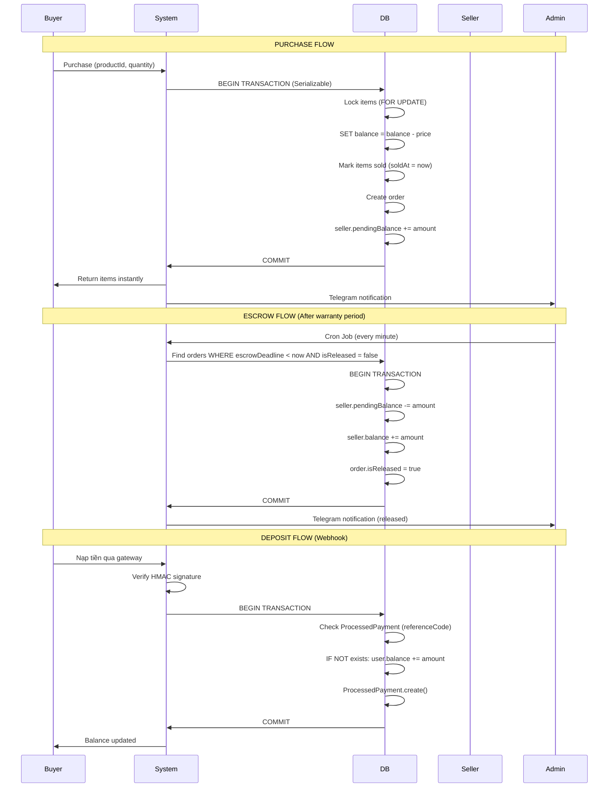

# 5 Critical Enhancements - MMO Marketplace Anti-Fraud System

## Overview
Đã bổ sung 5 cải tiến quan trọng để tăng cường bảo mật và chống gian lận cho hệ thống MMO Marketplace.

---

## 1. ✅ ProductItem Optimization (Tối ưu kho hàng)

### Changes Made:
```prisma
model ProductItem {
  id          Int       @id @default(autoincrement())
  productId   Int
  content     String    // user|pass|cookie
  contentHash String    @unique // SHA-256 hash để chống duplicate
  metadata    Json?     // Lưu proxy, device info, IP, etc
  addedAt     DateTime  @default(now()) // Thời điểm nhập kho
  soldAt      DateTime? // Thời điểm bán
  isSold      Boolean   @default(false)
  orderId     Int?
}
```

### Benefits:
- **contentHash (UNIQUE)**: Ngăn seller upload cùng một account nhiều lần
- **metadata (JSON)**: Lưu thông tin bổ sung (proxy, device, IP) để đối soát khi có khiếu nại
- **addedAt**: Biết chính xác item được nhập kho khi nào
- **soldAt**: Track thời gian bán để phân tích

### Implementation:
File: [`lib/utils/content.ts`](file:///d:/tool/mmo_digital/lib/utils/content.ts)
```typescript
// Generate SHA-256 hash
export function generateContentHash(content: string): string {
  return crypto.createHash('sha256').update(content.trim()).digest('hex');
}
```

---

## 2. ✅ Double-Spending Prevention (Chống gian lận số dư)

### Problem:
User mở 2 tab và bấm mua cùng lúc → có thể mua 2 lần cùng một số tiền

### Solution:
```typescript
// OLD (có thể bị double-spending):
await tx.user.update({
  where: { id: buyerId },
  data: { balance: { decrement: totalPrice } }
});

// NEW (safe against double-spending):
await tx.$executeRaw`
  UPDATE "User" 
  SET balance = balance - ${totalPrice}
  WHERE id = ${buyerId} 
  AND balance >= ${totalPrice}
`;

// Verify success
const updatedBuyer = await tx.user.findUnique({
  where: { id: buyerId },
  select: { balance: true }
});

if (Number(updatedBuyer.balance) !== balanceAfter) {
  throw new Error('Balance update failed - possible concurrent transaction');
}
```

### Why This Works:
- `SET balance = balance - amount` thực hiện trên database level
- Check `AND balance >= totalPrice` đảm bảo không bị âm
- Verify sau khi update để phát hiện concurrent issues

---

## 3. ✅ Escrow Release System (Cơ chế giải ngân tự động)

### Changes Made:

**Schema Update:**
```prisma
model Order {
  // ... existing fields
  isReleased     Boolean   @default(false) // Đã giải ngân chưa
  releasedAt     DateTime? // Thời điểm giải ngân
}
```

**Cron Job Logic:**
File: [`app/api/cron/escrow-release/route.ts`](file:///d:/tool/mmo_digital/app/api/cron/escrow-release/route.ts)

```typescript
// Find orders ready for release
const expiredOrders = await prisma.order.findMany({
  where: {
    escrowDeadline: { lte:now },
    status: 'COMPLETED', // Not disputed
    isReleased: false,   // Not yet released
  },
});

// Process each order
for (const order of expiredOrders) {
  await prisma.$transaction(async (tx) => {
    // Move pendingBalance → balance
    await tx.user.update({
      where: { id: sellerId },
      data: {
        pendingBalance: { decrement: amount },
        balance: { increment: amount },
      },
    });

    // Mark as released
    await tx.order.update({
      where: { id: order.id },
      data: {
        isReleased: true,
        releasedAt: new Date(),
      },
    });
  });
}
```

### Benefits:
- `isReleased = false` đảm bảo không giải ngân 2 lần
- Có audit trail với `releasedAt` timestamp
- Cron job chạy mỗi phút tự động giải ngân

### Setup Cron:
```bash
# Option 1: Vercel Cron (vercel.json)
{
  "crons": [{
    "path": "/api/cron/escrow-release",
    "schedule": "* * * * *"
  }]
}

# Option 2: External service (like cron-job.org)
POST https://your-domain.com/api/cron/escrow-release
Authorization: Bearer YOUR_CRON_SECRET
```

---

## 4. ✅ Duplicate Content Detection (Quan trọng nhất với MMO)

### Problem:
Seller lấy account đã bán ở sàn khác hoặc đăng 1 acc nhiều lần

### Solution:
```typescript
// When seller uploads items:
import { generateContentHash } from '@/lib/utils/content';

const contentHash = generateContentHash(content); // SHA-256

await prisma.productItem.create({
  data: {
    productId,
    content,
    contentHash, // UNIQUE constraint
    metadata: {
      proxy: "1.2.3.4:8080",
      deviceInfo: "iPhone 13",
      uploadedIp: req.ip,
    },
  },
});
```

### What Happens:
- Database sẽ **reject** nếu `contentHash` đã tồn tại
- Error: `Unique constraint failed on contentHash`
- Seller không thể upload trùng 100%

### Benefit:
Bảo vệ buyer khỏi việc mua trùng account

---

## 5. ✅ Webhook Payment Idempotency (Cải thiện nạp tiền)

### Problem:
Payment gateway đôi khi gửi callback 2-3 lần → user được cộng tiền nhiều lần

### Solution:

**New Table:**
```prisma
model ProcessedPayment {
  id            Int      @id @default(autoincrement())
  referenceCode String   @unique // Transaction ID từ gateway
  transactionId String
  userId        Int
  amount        Decimal
  processedAt   DateTime @default(now())
}
```

**Updated Logic:**
```typescript
export async function processDeposit(
  userId: number,
  amount: number,
  referenceCode: string,
  transactionId: string
) {
  return await prisma.$transaction(async (tx) => {
    // Check ProcessedPayment table
    const existing = await tx.processedPayment.findUnique({
      where: { referenceCode },
    });

    if (existing) {
      throw new Error('Payment already processed');
    }

    // Add balance
    await tx.user.update({
      where: { id: userId },
      data: { balance: { increment: amount } },
    });

    // Record in ProcessedPayment
    await tx.processedPayment.create({
      data: { userId, amount, referenceCode, transactionId },
    });

    return { success: true };
  });
}
```

### Benefits:
- Idempotent: Gọi 10 lần vẫn chỉ cộng tiền 1 lần
- `referenceCode` UNIQUE đảm bảo không duplicate
- Có audit trail đầy đủ trong `ProcessedPayment`

---

## Money Flow Diagram



---

## Summary of Changes

| Enhancement | File | Impact |
|------------|------|--------|
| ProductItem metadata | `prisma/schema.prisma` | Anti-duplicate, audit trail |
| Double-spending prevention | `lib/transactions/atomic.ts` | 100% safe balance deduction |
| Escrow release tracking | `prisma/schema.prisma`, `lib/transactions/atomic.ts` | No double-release |
| Content hash dedup | `lib/utils/content.ts`, `schema.prisma` | Prevent duplicate accounts |
| Webhook idempotency | `schema.prisma`, `api/webhooks/payments/route.ts` | No double deposits |

---

## Testing Checklist

### 1. Double-Spending Test
- [ ] User A has 100đ balance
- [ ] User A opens 2 tabs, both buy 100đ product simultaneously
- [ ] Expected: 1 succeeds, 1 fails with "insufficient balance"
- [ ] Verify: User A balance = 0đ (not negative)

### 2. Duplicate Content Test
- [ ] Seller uploads account "user1|pass1|cookie1"
- [ ] Seller tries to upload same account again
- [ ] Expected: Error "Unique constraint failed on contentHash"

### 3. Webhook Idempotency Test
- [ ] Payment gateway sends callback for 100đ deposit
- [ ] Manually call webhook API 3 more times with same data
- [ ] Expected: Balance only increases by 100đ (not 400đ)
- [ ] Verify: ProcessedPayment table has only 1 record

### 4. Escrow Release Test
- [ ] Create order with 1-hour warranty
- [ ] Wait 1 hour (or manually set escrowDeadline to past)
- [ ] Trigger cron: `POST /api/cron/escrow-release`
- [ ] Expected: Seller's pendingBalance → balance
- [ ] Verify: order.isReleased = true, order.releasedAt is set

### 5. Metadata Tracking Test
- [ ] Upload product item with metadata
- [ ] Create dispute on that item
- [ ] Admin can see proxy, device info, upload time
- [ ] Helps in fraud investigation

---

## Migration Commands

```bash
# Regenerate Prisma client
npx prisma generate

# Create migration
npx prisma migrate dev --name add_anti_fraud_enhancements

# Push to database (dev)
npx prisma db push
```

---

## Environment Variables

Add to `.env`:
```env
# Cron job secret for escrow release
CRON_SECRET="your-secure-cron-secret-here"
```

---

## Next Steps

1. ✅ Schema migrated
2. ✅ Code updated
3. ⏳ Run database migration
4. ⏳ Test all 5 enhancements
5. ⏳ Setup cron job for escrow release
6. ⏳ Monitor ProcessedPayment table for duplicates

Hệ thống hiện đã sẵn sàng cho production với bảo mật cao nhất! 🎯
